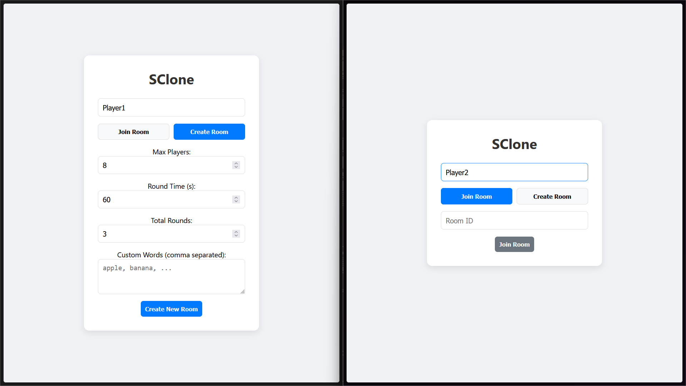
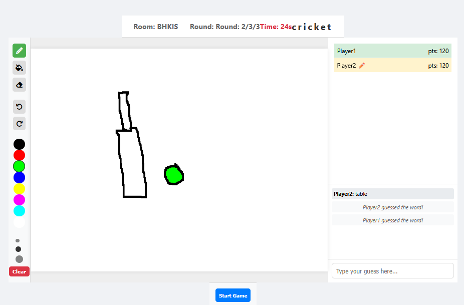
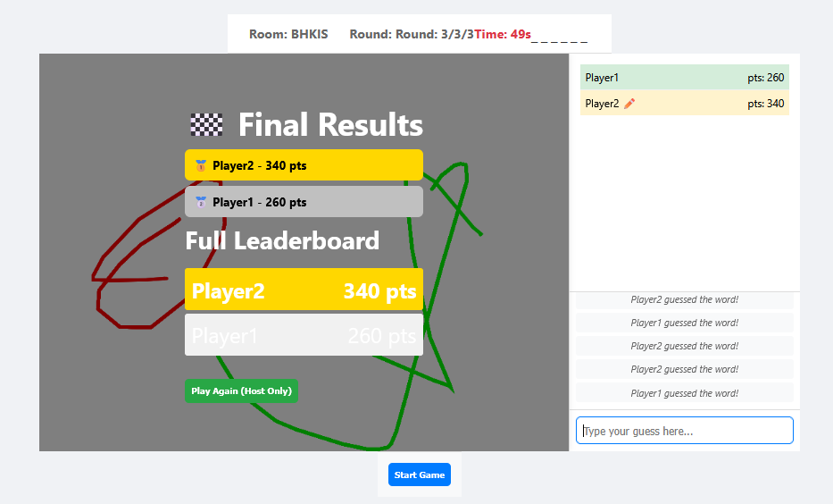

# SClone - Multiplayer Drawing Game

A real-time multiplayer drawing and guessing game inspired by Skribbl.io.

## Features
- **Multiplayer**: Create or join rooms with friends.
- **Real-time Drawing**: Smooth drawing synchronization using Socket.IO.
- **Drawing Tools**: 
  - ✏️ Pencil for drawing
  - 🪣 Bucket/fill tool for coloring areas
  - 🧽 Eraser for corrections
  - ↩️ Undo functionality with multiplayer sync
  - ↪️ Redo functionality with multiplayer sync
- **Game Logic**: Turn-based system with word selection, drawing, and guessing phases.
- **Enhanced Leaderboard**: Podium-style results with gold/silver/bronze medals.
- **Room Configuration**: Customize round time, max players, total rounds, and custom words.
- **Chat**: Real-time chat for guessing words and talking to other players.
- **Security**: Input validation, rate limiting, and XSS protection.

## Prerequisites
- Node.js installed.

## Installation
1.  Open a terminal in the project directory.
2.  Install dependencies:
    ```bash
    npm install express socket.io
    ```

## Running the Game
1.  Start the server:
    ```bash
    node server/server.js
    ```
2.  Open your web browser and navigate to:
    ```
    http://localhost:3000
    ```
3.  Create a room or join an existing one!

## How to Play
1.  **Host**: Create a room, configure settings (optional), and share the **Room ID** or just wait for friends to join if local.
2.  **Join**: Enter your name and the Room ID to join.
3.  **Start**: Once at least 2 players are in, the host can start the game.
4.  **Game Loop**:
    - **Pick**: The artist picks a word.
    - **Draw**: The artist draws the word using pencil, bucket fill, or eraser tools.
    - **Undo/Redo**: The drawer can undo/redo strokes, with changes synchronized to all players.
    - **Guess**: Others guess the word in the chat.
    - **Score**: Points are awarded for speed and accuracy.
    - **Results**: View the enhanced leaderboard with podium medals at game end.

## Screenshots

### Room Creation


### Game Interface with Drawing Tools


### Leaderboard Results


## Technical Details

### Architecture
- **Server**: Node.js with Express and Socket.IO
- **Client**: Vanilla JavaScript with HTML5 Canvas
- **Real-time Communication**: Socket.IO for multiplayer synchronization

### Key Features
- **Server-Authoritative Drawing**: All drawing strokes are stored on the server for consistency
- **Undo/Redo System**: Full stroke history with redo stack, synchronized across all players
- **Security**: Input validation, rate limiting, and XSS protection
- **Robust Room Management**: Prevents race conditions and handles player joins/leaves gracefully

### Environment Variables (Optional)
- `ENABLE_CANVAS_STATE_SYNC=1`: Enable legacy canvas state synchronization (default: disabled)
